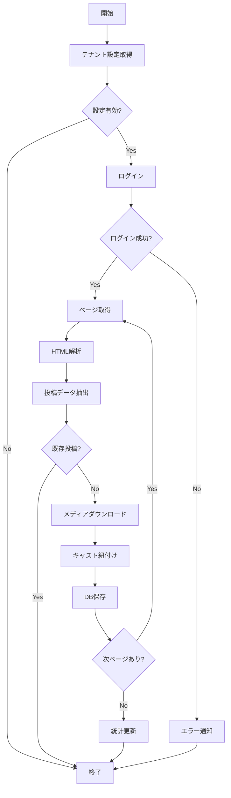
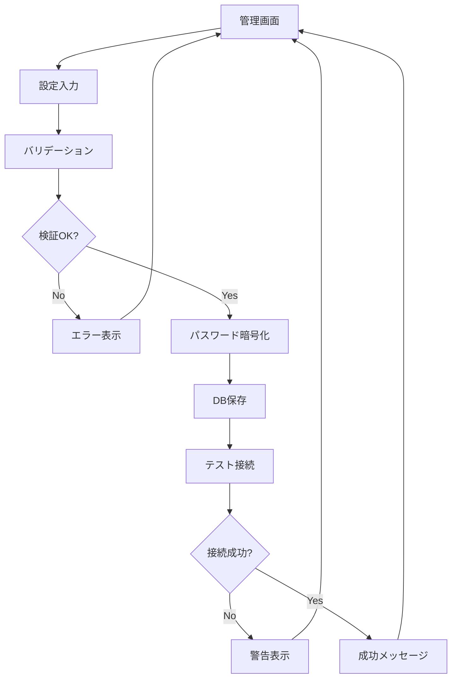
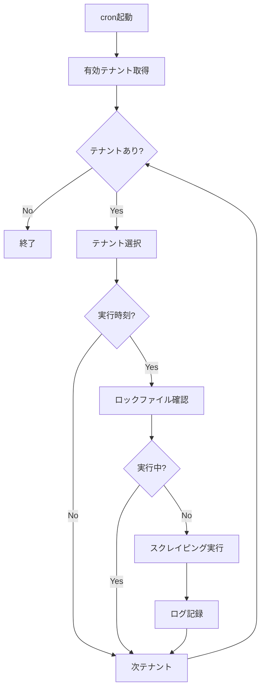

# 写メ日記スクレイピング機能 - プルキャス導入設計書

**作成日**: 2026-02-14  
**バージョン**: 1.0  
**ステータス**: 設計中

---

## 📋 目次

1. [概要](#概要)
2. [要件定義](#要件定義)
3. [システム構成](#システム構成)
4. [データベース設計](#データベース設計)
5. [機能設計](#機能設計)
6. [管理画面設計](#管理画面設計)
7. [セキュリティ設計](#セキュリティ設計)
8. [実装計画](#実装計画)

---

## 概要

### 目的
参考サイト（club-houman.com）で実装されている写メ日記スクレイピング機能を、プルキャスのマルチテナント環境に導入する。

### 参考実装
- **参照元**: `reference/public_html/admin/diary_scrape/`
- **主要ファイル**:
  - `config/scrape_config.php` - 設定ファイル
  - `includes/scraper_functions.php` - スクレイピング処理
  - `login_and_scrape.php` - メイン実行スクリプト
  - `index.php` - 管理画面

### 主な変更点
| 項目 | 参考サイト | プルキャス |
|------|-----------|-----------|
| 環境 | シングルテナント | **マルチテナント** |
| 設定 | ハードコード | **テナント毎にDB管理** |
| ログイン情報 | 固定 | **テナント毎に設定** |
| データ保存 | 単一DB | **テナント別DB** |
| 管理画面 | 独立 | **統合管理画面** |

---

## 要件定義

### 機能要件

#### FR-1: テナント別設定管理
- [ ] テナント毎にCityHeavenログイン情報を設定可能
- [ ] テナント毎にスクレイピング対象URLを設定可能
- [ ] テナント毎に自動取得ON/OFF切替可能
- [ ] テナント毎に取得間隔を設定可能

#### FR-2: スクレイピング機能
- [ ] CityHeavenへの自動ログイン
- [ ] 写メ日記一覧ページからデータ取得
- [ ] 画像・動画のダウンロード
- [ ] キャスト情報との紐付け
- [ ] 重複チェック（既存投稿スキップ）

#### FR-3: 管理画面
- [ ] スクレイピング設定画面
- [ ] 手動実行ボタン
- [ ] 実行ログ表示
- [ ] 取得統計表示
- [ ] 緊急停止機能

#### FR-4: 自動実行
- [ ] cron設定による定期実行
- [ ] テナント毎の実行スケジュール管理
- [ ] エラー通知機能

### 非機能要件

#### NFR-1: パフォーマンス
- [ ] 複数テナントの並列実行対応
- [ ] リクエスト間隔調整（サーバー負荷軽減）
- [ ] タイムアウト設定

#### NFR-2: セキュリティ
- [ ] ログイン情報の暗号化保存
- [ ] CSRF対策
- [ ] 管理者権限チェック

#### NFR-3: 保守性
- [ ] ログファイルの自動ローテーション
- [ ] エラーハンドリング
- [ ] デバッグモード

---

## システム構成

### ディレクトリ構造

```
www/
├── app/
│   └── manage/
│       └── diary_scrape/              # 写メ日記スクレイピング管理
│           ├── index.php              # 管理画面（設定・実行）
│           ├── config.php             # 設定保存・取得
│           ├── execute.php            # 手動実行エンドポイント
│           ├── status.php             # 実行状態確認API
│           ├── logs.php               # ログ表示
│           └── includes/
│               ├── scraper.php        # スクレイピングクラス
│               ├── database.php       # DB処理クラス
│               └── logger.php         # ログ処理クラス
│
├── cron/
│   └── diary_scrape.php               # cron実行スクリプト
│
└── uploads/
    └── diary/                         # テナント別画像保存
        └── {tenant_id}/
            ├── thumbs/
            ├── images/
            └── videos/
```

### クラス設計

```php
// スクレイピングクラス
class DiaryScraper {
    private $tenantId;
    private $config;
    private $curl;
    private $logger;
    
    public function __construct($tenantId);
    public function login();
    public function fetchDiaryPage($page = 1);
    public function parsePostsFromHtml($html);
    public function downloadFile($url, $type, $pdId);
}

// データベース処理クラス
class DiaryDatabase {
    private $tenantId;
    private $pdo;
    
    public function __construct($tenantId);
    public function savePost($postData);
    public function existsPdId($pdId);
    public function getCastIdByName($name);
}

// ログ処理クラス
class DiaryLogger {
    private $tenantId;
    private $logFile;
    
    public function __construct($tenantId);
    public function info($message, $context = []);
    public function error($message, $context = []);
    public function debug($message, $context = []);
}
```

---

## データベース設計

### 1. テナント設定テーブル（プラットフォームDB）

```sql
-- 写メ日記スクレイピング設定
CREATE TABLE IF NOT EXISTS diary_scrape_settings (
    id INT AUTO_INCREMENT PRIMARY KEY,
    tenant_id INT NOT NULL,
    
    -- CityHeavenログイン情報
    cityheaven_login_id VARCHAR(255) NOT NULL COMMENT 'ログインID（メールアドレス）',
    cityheaven_password VARCHAR(255) NOT NULL COMMENT 'パスワード（暗号化）',
    
    -- スクレイピング対象URL
    shop_url VARCHAR(500) NOT NULL COMMENT '店舗URL（例: /fukuoka/A4001/A400101/houmantengoku/）',
    
    -- 実行設定
    is_enabled TINYINT(1) DEFAULT 0 COMMENT '自動取得ON/OFF',
    scrape_interval INT DEFAULT 10 COMMENT '取得間隔（分）',
    request_delay DECIMAL(3,1) DEFAULT 0.5 COMMENT 'リクエスト間隔（秒）',
    max_pages INT DEFAULT 50 COMMENT '最大ページ数',
    
    -- Cookie管理
    cookie_data TEXT COMMENT 'Cookie情報（JSON）',
    cookie_updated_at DATETIME COMMENT 'Cookie更新日時',
    
    -- 実行状態
    last_executed_at DATETIME COMMENT '最終実行日時',
    last_execution_status ENUM('success', 'error', 'running') COMMENT '最終実行状態',
    last_error_message TEXT COMMENT '最終エラーメッセージ',
    
    -- 統計情報
    total_posts_scraped INT DEFAULT 0 COMMENT '累計取得投稿数',
    last_posts_count INT DEFAULT 0 COMMENT '最終取得投稿数',
    
    created_at DATETIME DEFAULT CURRENT_TIMESTAMP,
    updated_at DATETIME DEFAULT CURRENT_TIMESTAMP ON UPDATE CURRENT_TIMESTAMP,
    
    UNIQUE KEY unique_tenant (tenant_id),
    FOREIGN KEY (tenant_id) REFERENCES tenants(id) ON DELETE CASCADE,
    INDEX idx_enabled (is_enabled),
    INDEX idx_last_executed (last_executed_at)
) ENGINE=InnoDB DEFAULT CHARSET=utf8mb4 COLLATE=utf8mb4_unicode_ci;
```

### 2. 投稿データテーブル（プラットフォームDB）★変更

**重要**: テナントDBではなく、プラットフォームDBで一元管理

```sql
-- 写メ日記投稿データ（全テナント共通）
CREATE TABLE IF NOT EXISTS diary_posts (
    id INT AUTO_INCREMENT PRIMARY KEY,
    tenant_id INT NOT NULL COMMENT 'テナントID',
    pd_id BIGINT NOT NULL COMMENT 'CityHeavenの投稿ID',
    
    -- キャスト情報
    cast_id INT NOT NULL COMMENT 'キャストID（テナントDB内のID）',
    cast_name VARCHAR(100) NOT NULL COMMENT 'キャスト名（スナップショット・表示用）',
    
    -- 投稿情報
    title VARCHAR(500) COMMENT 'タイトル',
    posted_at DATETIME NOT NULL COMMENT '投稿日時',
    
    -- メディア情報
    thumb_url VARCHAR(500) COMMENT 'サムネイル画像URL',
    video_url VARCHAR(500) COMMENT '動画URL',
    poster_url VARCHAR(500) COMMENT '動画ポスター画像URL',
    has_video TINYINT(1) DEFAULT 0 COMMENT '動画有無',
    
    -- 本文
    html_body TEXT COMMENT '本文HTML',
    content_hash VARCHAR(64) COMMENT '本文ハッシュ値（重複チェック用）',
    
    -- メタ情報
    detail_url VARCHAR(500) COMMENT '詳細ページURL',
    is_my_girl_limited TINYINT(1) DEFAULT 0 COMMENT 'マイガール限定投稿',
    
    created_at DATETIME DEFAULT CURRENT_TIMESTAMP,
    updated_at DATETIME DEFAULT CURRENT_TIMESTAMP ON UPDATE CURRENT_TIMESTAMP,
    
    -- インデックス
    UNIQUE KEY unique_tenant_pd (tenant_id, pd_id),
    INDEX idx_tenant_id (tenant_id),
    INDEX idx_tenant_cast (tenant_id, cast_id),
    INDEX idx_posted_at (posted_at),
    INDEX idx_tenant_posted (tenant_id, posted_at),
    
    -- テナント削除時に自動削除
    FOREIGN KEY (tenant_id) REFERENCES tenants(id) ON DELETE CASCADE
) ENGINE=InnoDB DEFAULT CHARSET=utf8mb4 COLLATE=utf8mb4_unicode_ci;
```

**設計変更の理由**:
- ✅ テナント削除時に自動削除（ON DELETE CASCADE）
- ✅ スキーマ変更が1回で済む
- ✅ 横断検索・統計が容易
- ✅ メンテナンス性が高い
- ✅ cast_id + tenant_idで一意に識別

### 3. 実行ログテーブル（プラットフォームDB）

```sql
-- スクレイピング実行ログ
CREATE TABLE IF NOT EXISTS diary_scrape_logs (
    id INT AUTO_INCREMENT PRIMARY KEY,
    tenant_id INT NOT NULL,
    
    -- 実行情報
    execution_type ENUM('manual', 'cron') NOT NULL COMMENT '実行タイプ',
    started_at DATETIME NOT NULL COMMENT '開始日時',
    finished_at DATETIME COMMENT '終了日時',
    execution_time DECIMAL(10,2) COMMENT '実行時間（秒）',
    
    -- 実行結果
    status ENUM('success', 'error', 'timeout') NOT NULL COMMENT '実行結果',
    pages_processed INT DEFAULT 0 COMMENT '処理ページ数',
    posts_found INT DEFAULT 0 COMMENT '検出投稿数',
    posts_saved INT DEFAULT 0 COMMENT '保存投稿数',
    posts_skipped INT DEFAULT 0 COMMENT 'スキップ投稿数',
    errors_count INT DEFAULT 0 COMMENT 'エラー数',
    
    -- エラー情報
    error_message TEXT COMMENT 'エラーメッセージ',
    
    -- メタ情報
    memory_usage DECIMAL(10,2) COMMENT 'メモリ使用量（MB）',
    
    created_at DATETIME DEFAULT CURRENT_TIMESTAMP,
    
    INDEX idx_tenant_id (tenant_id),
    INDEX idx_started_at (started_at),
    INDEX idx_status (status),
    FOREIGN KEY (tenant_id) REFERENCES tenants(id) ON DELETE CASCADE
) ENGINE=InnoDB DEFAULT CHARSET=utf8mb4 COLLATE=utf8mb4_unicode_ci;
```

---

## 機能設計

### 1. スクレイピング処理フロー



### 2. 設定管理フロー



### 3. cron実行フロー



---

## 管理画面設計

### 画面構成

#### 1. 設定画面（`/app/manage/diary_scrape/index.php`）

```
┌─────────────────────────────────────────┐
│ 写メ日記スクレイピング設定              │
├─────────────────────────────────────────┤
│                                         │
│ ■ CityHeavenログイン情報                │
│   ログインID: [________________]        │
│   パスワード: [________________]        │
│                                         │
│ ■ スクレイピング設定                     │
│   店舗URL: [________________________]   │
│   例: /fukuoka/A4001/A400101/shop/     │
│                                         │
│   自動取得: [ON] OFF                    │
│   取得間隔: [10] 分                     │
│   リクエスト間隔: [0.5] 秒              │
│                                         │
│ ■ 実行状態                               │
│   最終実行: 2026-02-14 10:30           │
│   実行結果: ✅ 成功（15件取得）          │
│   累計取得: 1,234件                     │
│                                         │
│ [設定を保存] [接続テスト]               │
│                                         │
├─────────────────────────────────────────┤
│ ■ 手動実行                               │
│   [新着取得を実行] [全件取得を実行]     │
│                                         │
│ ■ 実行ログ                               │
│   [最新100件を表示]                     │
│                                         │
└─────────────────────────────────────────┘
```

#### 2. 実行画面（モーダル）

```
┌─────────────────────────────────────────┐
│ 写メ日記取得中...                       │
├─────────────────────────────────────────┤
│                                         │
│   現在 15 件取得中...                   │
│   経過時間: 00:45                       │
│                                         │
│   ━━━━━━━━━━━━━━━━━━━━━━━━━━━━━━━━━━  │
│                                         │
│   [❌ 実行を停止]                        │
│                                         │
└─────────────────────────────────────────┘
```

### UIコンポーネント

#### トグルスイッチ（自動取得ON/OFF）
```html
<div class="toggle-wrapper">
    <span class="toggle-label">自動取得</span>
    <label class="toggle-switch">
        <input type="checkbox" id="auto-scrape-toggle">
        <span class="toggle-slider"></span>
    </label>
    <span class="toggle-status">ON</span>
</div>
```

#### 統計カード
```html
<div class="stat-card">
    <h3>取得統計</h3>
    <div class="stat-number">1,234</div>
    <div class="stat-label">累計投稿数</div>
</div>
```

---

## セキュリティ設計

### 1. パスワード暗号化

```php
// 保存時
$encrypted = openssl_encrypt(
    $password,
    'AES-256-CBC',
    ENCRYPTION_KEY,
    0,
    ENCRYPTION_IV
);

// 取得時
$decrypted = openssl_decrypt(
    $encrypted,
    'AES-256-CBC',
    ENCRYPTION_KEY,
    0,
    ENCRYPTION_IV
);
```

### 2. CSRF対策

```php
// トークン生成
$csrfToken = generateCsrfToken();

// トークン検証
if (!verifyCsrfToken($_POST['csrf_token'])) {
    throw new Exception('不正なリクエストです');
}
```

### 3. 権限チェック

```php
// 管理者ログイン必須
requireTenantAdminLogin();

// テナント所有者チェック
if ($tenant['id'] !== getCurrentTenant()['id']) {
    throw new Exception('アクセス権限がありません');
}
```

### 4. ログイン情報の取り扱い

- [ ] 環境変数で暗号化キーを管理
- [ ] ログファイルにパスワードを出力しない
- [ ] Cookie情報の安全な保存

---

## 実装計画

### Phase 1: 基盤構築（1-2日）

- [ ] データベーステーブル作成
- [ ] ディレクトリ構造作成
- [ ] 基本クラス実装
  - [ ] `DiaryScraper`クラス
  - [ ] `DiaryDatabase`クラス
  - [ ] `DiaryLogger`クラス

### Phase 2: 管理画面実装（2-3日）

- [ ] 設定画面UI作成
- [ ] 設定保存・取得API
- [ ] パスワード暗号化実装
- [ ] 接続テスト機能
- [ ] 手動実行機能

### Phase 3: スクレイピング機能実装（3-4日）

- [ ] ログイン処理
- [ ] ページ取得・解析
- [ ] メディアダウンロード
- [ ] キャスト紐付け
- [ ] DB保存処理
- [ ] エラーハンドリング

### Phase 4: 自動実行実装（1-2日）

- [ ] cron実行スクリプト
- [ ] ロック機構
- [ ] 並列実行制御
- [ ] エラー通知

### Phase 5: テスト・調整（2-3日）

- [ ] 単体テスト
- [ ] 結合テスト
- [ ] 負荷テスト
- [ ] バグ修正

### Phase 6: ドキュメント・リリース（1日）

- [ ] 運用マニュアル作成
- [ ] リリースノート作成
- [ ] 本番環境デプロイ

**合計見積もり**: 10-15日

---

## 技術的課題と対策

### 課題1: マルチテナント対応

**課題**: 複数テナントの並列実行時のリソース管理

**対策**:
- テナント毎にロックファイルを作成
- 同時実行数の制限（最大3テナント）
- メモリ使用量の監視

### 課題2: Cookie管理

**課題**: テナント毎のCookie情報の保存・管理

**対策**:
- DB内にJSON形式で保存
- 有効期限の管理
- 定期的な再ログイン

### 課題3: エラーハンドリング

**課題**: ログイン失敗・ネットワークエラーの対応

**対策**:
- リトライ機構（最大3回）
- タイムアウト設定
- エラー通知機能

### 課題4: XPath変更対応

**課題**: CityHeavenのHTML構造変更

**対策**:
- 複数のXPathパターンを用意
- フォールバック機構
- 管理画面でXPath設定可能に（将来対応）

---

## 参考資料

### 参考実装ファイル
- `reference/public_html/admin/diary_scrape/config/scrape_config.php`
- `reference/public_html/admin/diary_scrape/includes/scraper_functions.php`
- `reference/public_html/admin/diary_scrape/login_and_scrape.php`
- `reference/public_html/admin/diary_scrape/index.php`

### 関連ドキュメント
- プルキャス開発仕様書
- マルチテナント構想書
- データベース設計書

---

## 変更履歴

| 日付 | バージョン | 変更内容 | 担当者 |
|------|-----------|---------|--------|
| 2026-02-14 | 1.0 | 初版作成 | - |

---

## レビュー・承認

| 役割 | 氏名 | 日付 | 署名 |
|------|------|------|------|
| 設計者 | - | 2026-02-14 | - |
| レビュアー | - | - | - |
| 承認者 | - | - | - |
